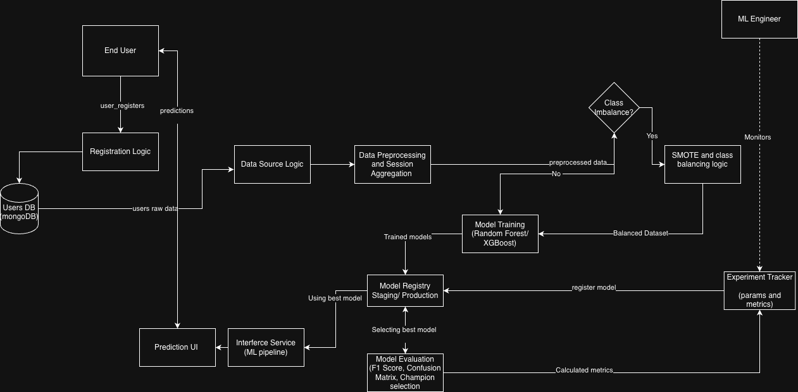

# Airbnb Destination Prediction 

An end-to-end machine learning pipeline for predicting a user's first booking destination using demographic attributes and raw clickstream session behavior. This project addresses a cold-start personalization problem in the travel domain, where predictions are made using limited early-stage user information to improve destination recommendation and booking conversion.

---

# Project Overview

A global travel platform aims to predict where a newly registered user is most likely to make their first booking.

The challenge is to infer destination preference before the user completes extensive browsing or booking actions. This enables early personalization of homepage recommendations, targeted marketing campaigns, and improved conversion rates.

The project uses:

- User demographic information
- Signup metadata
- Raw clickstream session logs

The target is a multi-class classification problem with 12 destination classes, including:

- NDF (No Destination Found)
- US
- Other international destinations

This dataset presents major challenges such as:

- Extreme class imbalance
- Large-scale clickstream aggregation
- Cold-start users with no session history
- Text-heavy categorical behavioral signals

---

# Business Objective

The objective is to build a machine learning system that predicts a user's likely first booking destination immediately after signup.

## Business impact:

- Improve homepage personalization
- Increase booking conversion rate
- Enable targeted destination-based marketing
- Reduce generic recommendation exposure

---

# Problem Statement

Convert raw user-level and session-level behavioral data into predictive user representations for destination prediction.

The system must:

- Handle users with session history
- Handle users without session history
- Extract signal from clickstream actions
- Work under severe class imbalance

---

# Workflow

## Sprint 1: Discovery & Baseline

- Understand business problem
- Profile datasets
- Clean user data
- Aggregate sessions
- Build baseline model

## Sprint 2: Refinement & Modeling

- Advanced feature engineering
- Text vectorization
- Model comparison
- Error analysis
- Demo preparation

---

# Feature Engineering Strategy

## User Features

- Age buckets
- Signup method encoding
- Affiliate source grouping
- Browser categories

## Session Aggregates

- Total actions
- Unique actions
- Total seconds elapsed
- Average session time
- First action
- Last action
- Device diversity

## Behavioral Ratios

- Search ratio
- Booking related ratio
- Messaging ratio

## Text Features

User action sequence treated as document:

Example:

search_results click listing message

TF-IDF / CountVectorizer applied on action sequences.

---

# Modeling Approach

## Baseline Model

- Logistic Regression

## Compared Models

- Random Forest
- XGBoost

# Critical Challenges

## Class Imbalance

- NDF dominates target distribution
- Minority destinations difficult to learn

## Cold Start Problem

Some users have no session data.

## Session Aggregation

Multiple rows per user must be converted to one predictive vector.

## Sparse Text Signals

Action labels generate high dimensional sparse features.

---

# Design Documents

## [HLD (High Level Design)](./docs/HLD.md)

Contains:

- business architecture
- data flow
- prediction pipeline
- assumptions

## LLD (Low-Level Design)

Contains:

- feature inventory
- preprocessing plan
- model hypotheses
- validation logic

---

# Future Improvements

- Sequence modeling using action order
- Recency-weighted session features
- Rare-class boosting
- Two-model architecture for no-session users

---

# Contributors

- [Niranjan Hebli](https://github.com/NiranjanHebli)

- [Sudhanshu Biswas](https://github.com/SudhanshuBiswas01)

- [Het Patel](https://github.com/Het0808)

- [Anirudh Sharma](https://github.com/anirudhkrishnatreya)

- [Avik Chatterjee](https://github.com/Avichatt)